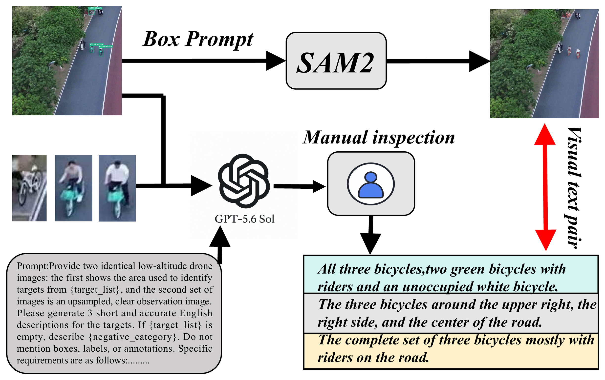
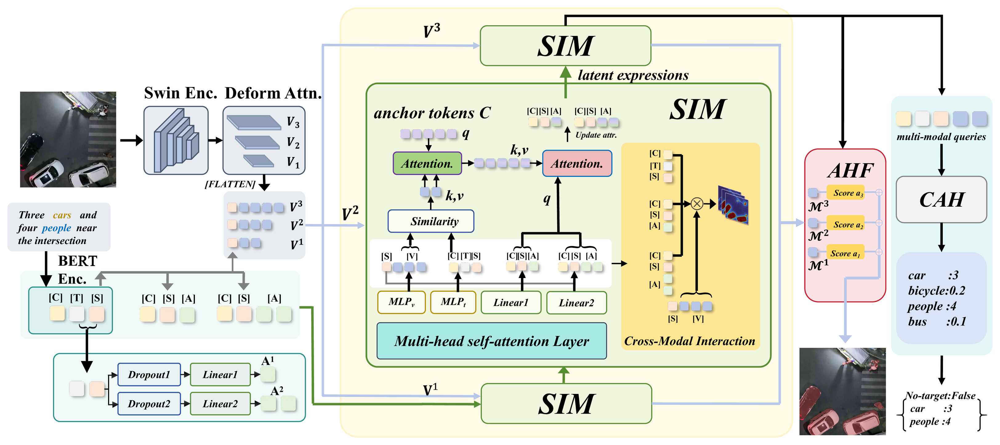
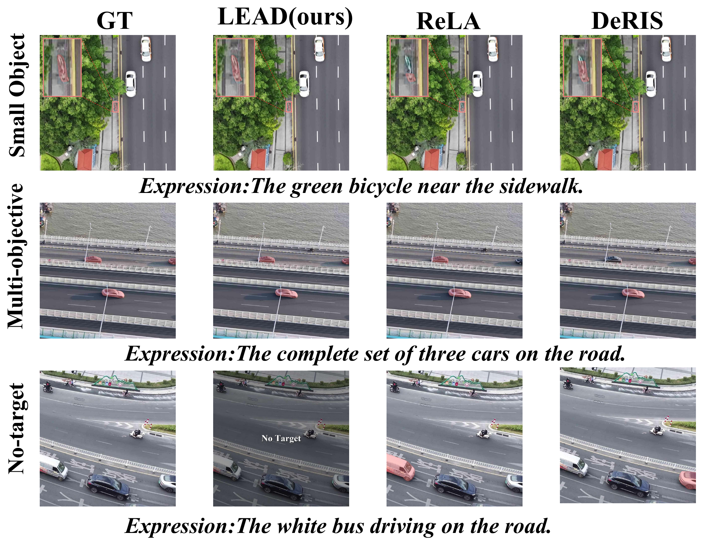
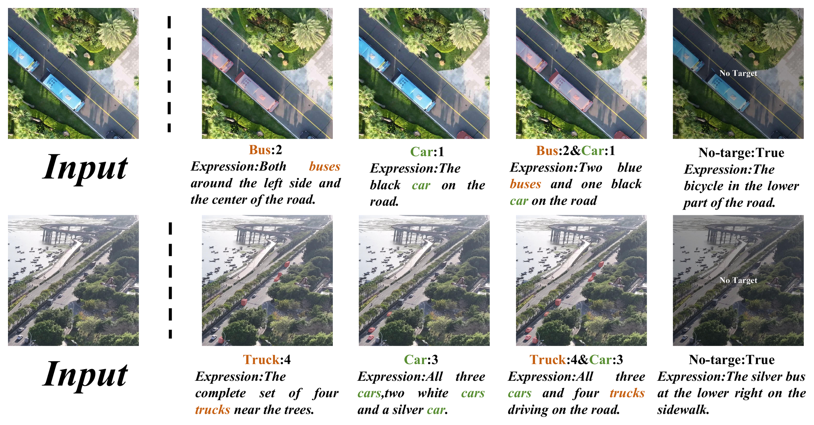
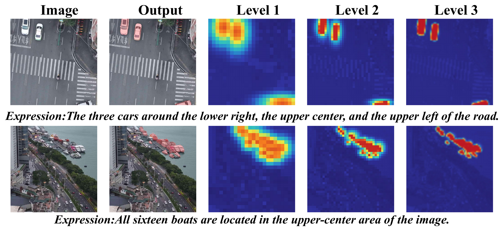
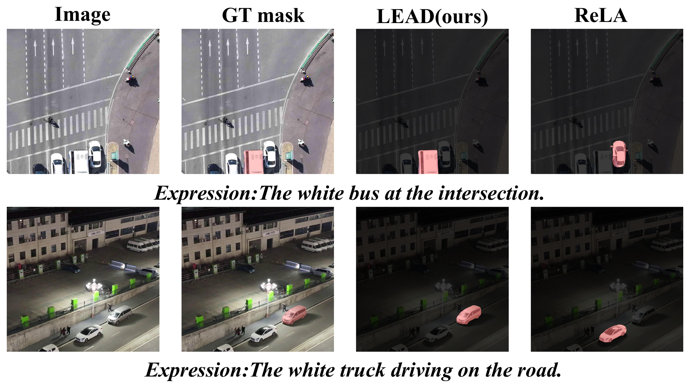
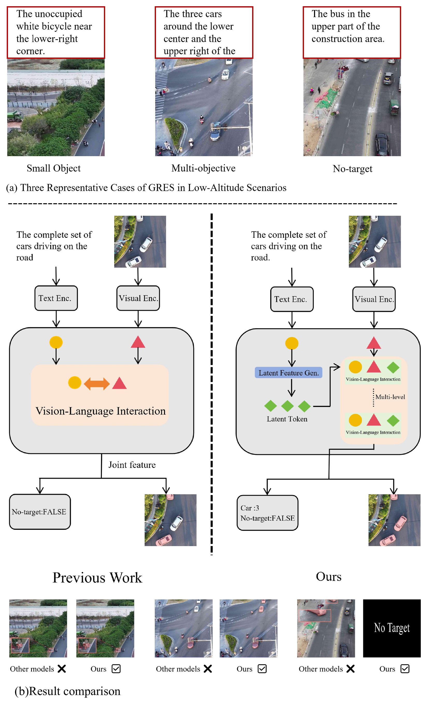

<div align="center">

# LEAD

### Latent Expression Refinement and Adaptive Hierarchical Count-aware Decoding<br>for Generalized Referring Expression Segmentation in Low-Altitude UAV Scenes

**One expression. Complementary visual cues. Precise target grounding.**


**[Dataset on Hugging Face](https://huggingface.co/datasets/Zhengku1n/LAU-GRES/tree/main)** &nbsp;·&nbsp; **[Supplementary Material (PDF)](assets/supplementary/ICASSP2027_Supplement.pdf)** &nbsp;·&nbsp; **[Media Supplement (ZIP)](assets/supplementary/LEAD_Media_Supplement.zip?raw=true)**

[Dataset](#dataset) &nbsp;·&nbsp; [Overview](#overview) &nbsp;·&nbsp; [Method](#method) &nbsp;·&nbsp; [Results](#results) &nbsp;·&nbsp; [Visualizations](#visualizations) &nbsp;·&nbsp; [Getting Started](#getting-started)

</div>

---

## Dataset

**LAU-GRES** is a benchmark for **generalized referring expression segmentation in low-altitude UAV scenes**. It pairs drone imagery with natural-language expressions and pixel-level masks, covering expressions that refer to **one object, multiple objects, or no valid target**. Crowded scenes, small objects, oblique viewpoints, and nighttime illumination make it a challenging setting for visual grounding.

The manuscript describes **13,369 image-expression-mask triplets** spanning **eight object categories**, with a **7:1:2 train / validation / test split**. Built from CO-Drone imagery, the annotation pipeline combines box-prompted **SAM 2** segmentation, multimodal referring-expression generation, and **manual inspection and refinement** to align images, expressions, and masks.

<p align="center">
  <a href="assets/figures/dataset_pipeline.png">
    
  </a>
</p>
<p align="center"><em>Construction of LAU-GRES: from low-altitude UAV imagery to verified image-expression-mask annotations.</em></p>

| Property | Description |
| :--- | :--- |
| Categories | Pedestrian, bicycle, tricycle, car, motorcycle, truck, bus, boat |
| Referring scenarios | Single target, multiple targets, no target |
| Visual challenges | Small objects, crowded scenes, oblique viewpoints, and nighttime illumination |
| Annotation pipeline | SAM 2 masks, multimodal expression generation, and manual refinement |

**Download LAU-GRES from [Hugging Face](https://huggingface.co/datasets/Zhengku1n/LAU-GRES/tree/main).** See [dataset preparation](#2-prepare-lau-gres) for the expected data layout. Trained checkpoints are not included in this code repository.

## Overview

**LEAD** studies generalized referring expression segmentation in **low-altitude UAV imagery**, where small objects, dense scenes, changing viewpoints, and difficult illumination make language-guided segmentation challenging. Given an image and a natural-language expression, LEAD predicts the referred regions and category-wise target counts, covering **single-target, multi-target, and no-target** cases.

The key idea is to expand a single expression into **complementary latent expressions**, refine their visual grounding through a semantic hierarchy, and combine the resulting evidence with adaptive fusion and explicit counting.

<table align="center">
  <tr>
    <th align="center">58.19%</th>
    <th align="center">62.54%</th>
    <th align="center">+5.25 pts</th>
  </tr>
  <tr>
    <td align="center">Test gIoU on LAU-GRES</td>
    <td align="center">Test cIoU on LAU-GRES</td>
    <td align="center">Test gIoU over CoHD</td>
  </tr>
</table>

<p align="center"><sub>Results reported in the manuscript. LEAD and CoHD both use Swin-B / BERT encoders.</sub></p>

## Method

<p align="center">
  <a href="assets/figures/framework.png">
    
  </a>
</p>
<p align="center"><em>LEAD combines latent expression refinement, hierarchical visual-language interaction, adaptive fusion, and target counting.</em></p>

| Component | Role |
| :--- | :--- |
| **Hierarchical Latent Interaction Decoder (HLID)** | Builds latent expressions around a shared subject and complementary attributes, then refines visual-language correspondence across semantic levels. |
| **Adaptive Hierarchical Fusion (AHF)** | Selects and aggregates multi-level semantic responses to combine coarse localization with fine-grained object cues. |
| **Counting-Aware Head (CAH)** | Predicts category-specific counts and target existence to distinguish single, multiple, and absent targets. |

## Results

### LAU-GRES benchmark

**Test-set results from Table 2 of the manuscript.** All values are percentages; higher is better. Bold indicates the best result among the listed methods.

| Method | Encoders | P@0.5 ↑ | P@0.7 ↑ | gIoU ↑ | cIoU ↑ | mRR ↑ | rIoU ↑ |
| :--- | :--- | ---: | ---: | ---: | ---: | ---: | ---: |
| InstAlign | Swin-B / BERT | 45.02 | 25.28 | 47.10 | 53.68 | 80.54 | 44.71 |
| ReLA | Swin-B / BERT | 48.67 | 20.41 | 48.21 | 54.74 | 82.05 | 45.96 |
| DMMI | Swin-B / BERT | 47.05 | 31.33 | 49.17 | 55.71 | 83.12 | 46.89 |
| GSVA-7B | SAM + CLIP-L / Vicuna | 48.15 | 28.64 | 50.24 | 56.93 | 86.18 | 47.85 |
| CoHD | Swin-B / BERT | 50.37 | 31.15 | 52.94 | 59.77 | 88.73 | 50.61 |
| MABP | Swin-B / BERT | 47.21 | 24.02 | 49.72 | 55.62 | 88.20 | 50.44 |
| PropVG | BEiT3-ViT-B | 52.18 | 33.08 | 55.12 | 62.46 | 91.68 | 52.15 |
| DeRIS | Swin-B + SigLIP / Qwen2-7B | 52.06 | 33.21 | 54.04 | 62.39 | 91.76 | 52.89 |
| **LEAD (ours)** | **Swin-B / BERT** | **52.26** | **33.28** | **58.19** | **62.54** | **91.83** | **52.97** |

With the same Swin-B / BERT encoders, LEAD improves over CoHD by **5.25 gIoU**, **2.77 cIoU**, **3.10 mRR**, and **2.36 rIoU** percentage points on the test split.

<details>
<summary><b>Validation-set results</b></summary>

From Table 2 of the manuscript. All values are percentages.

| Method | P@0.5 ↑ | P@0.7 ↑ | gIoU ↑ | cIoU ↑ | mRR ↑ | rIoU ↑ |
| :--- | ---: | ---: | ---: | ---: | ---: | ---: |
| InstAlign | 47.11 | 28.44 | 50.02 | 56.12 | 84.79 | 47.32 |
| ReLA | 48.43 | 22.78 | 48.81 | 57.28 | 83.66 | 46.84 |
| DMMI | 46.26 | 30.81 | 51.06 | 58.36 | 84.65 | 48.58 |
| GSVA-7B | 50.20 | 31.91 | 52.10 | 59.49 | 87.91 | 49.76 |
| CoHD | 52.64 | 34.92 | 54.91 | 62.58 | 90.47 | 52.36 |
| MABP | 48.02 | 29.11 | 50.24 | 57.81 | 89.91 | 52.88 |
| PropVG | 52.62 | 32.90 | 56.78 | 64.90 | 93.52 | 53.97 |
| DeRIS | 54.22 | 36.32 | 58.01 | 65.02 | 93.41 | 54.71 |
| **LEAD (ours)** | **54.28** | **36.39** | **60.08** | **65.09** | **93.59** | **54.79** |

</details>

<details>
<summary><b>RefCOCO, RefCOCO+, and RefCOCOg results</b></summary>

LEAD results from Table 1 of the manuscript, evaluated using mIoU (%).

| Benchmark | Split | LEAD (Swin-B / BERT) |
| :--- | :--- | ---: |
| RefCOCO | val / testA / testB | 79.56 / 80.93 / 77.44 |
| RefCOCO+ | val / testA / testB | 73.27 / 76.74 / 67.41 |
| RefCOCOg | val (U) / test (U) / val (G) | 73.64 / 73.58 / 73.45 |

</details>

## Visualizations

### Comparison with other methods

<p align="center">
  <a href="assets/figures/qualitative_comparison.png">
    
  </a>
</p>
<p align="center"><em>Comparison with ReLA and DeRIS across small-object, multi-target, and no-target cases on LAU-GRES.</em></p>

### Different expressions, different targets

<p align="center">
  <a href="assets/figures/expression_conditioned_results.png">
    
  </a>
</p>
<p align="center"><em>LEAD selects different object combinations in the same scene and predicts their category-wise counts.</em></p>

<details>
<summary><b>Explore hierarchical semantic response maps</b></summary>

<p align="center">
  <a href="assets/figures/hierarchical_attention.png">
    
  </a>
</p>

The three semantic interaction levels provide complementary responses, progressing from coarse target localization toward more focused object regions before adaptive fusion.

</details>

<details>
<summary><b>Explore small-target and low-illumination comparisons</b></summary>

<p align="center">
  <a href="assets/figures/challenging_cases.png">
    
  </a>
</p>

Additional comparisons with ReLA illustrate target localization in crowded scenes and under challenging illumination.

</details>

<details>
<summary><b>Explore the task and conceptual comparison</b></summary>

<p align="center">
  <a href="assets/figures/concept_comparison.png">
    
  </a>
</p>

The concept figure contrasts a conventional joint representation with latent expression generation, multi-level visual-language interaction, and explicit target counting.

</details>

## Supplementary Materials

- **[Supplementary Material (PDF)](assets/supplementary/ICASSP2027_Supplement.pdf)** — Dataset construction details, experimental protocols, training objectives, and additional analyses.
- **[Media Supplement (ZIP)](assets/supplementary/LEAD_Media_Supplement.zip?raw=true)** — Additional visual examples with an accompanying manifest and README.

## Getting Started

### 1. Installation

Clone the repository and create a Python environment:

```bash
git clone https://github.com/megumi123896/LEAD.git
cd LEAD
conda create -n lead python=3.10 -y
conda activate lead
```

Install a CUDA-enabled **PyTorch / torchvision** pair appropriate for your GPU using the [official PyTorch installation guide](https://pytorch.org/get-started/locally/). Then install Detectron2 and the remaining dependencies:

```bash
python -m pip install 'git+https://github.com/facebookresearch/detectron2.git'
python -m pip install -r requirements.txt
```

Build the multi-scale deformable attention operator from the repository root:

```bash
cd gres_model/modeling/pixel_decoder/ops
sh make.sh
cd ../../../..
```

The build requires a compatible CUDA toolkit and C++ compiler. The commands above target a Linux CUDA environment.

<details>
<summary><b>Development environment and reproducibility notes</b></summary>

- [environment.yml](environment.yml) records the supplied development environment: Python 3.10.20, PyTorch 2.11.0+cu128, torchvision 0.26.0+cu128, and Detectron2 0.6. It is a platform-specific environment snapshot.
- The result tables above are transcribed from the manuscript; they are not newly reproduced measurements from this repository upload.
- The supplied [latent configuration](configs/referring_swin_base_latent.yaml) sets `LATENT_NUM_TOKENS: [6, 12]` and `LATENT_DROP_PROBS: [0.2, 0.15]`. The manuscript reports token lengths `[4, 6]` and dropout probabilities `[0.15, 0.20]`. These settings should be reconciled before attempting an exact reproduction of the paper results.
- Keep `MODEL.MASK_FORMER.NUM_OBJECT_QUERIES` consistent with `21 + sum(LATENT_NUM_TOKENS)` when changing the latent configuration.

</details>

### 2. Prepare LAU-GRES

Download the dataset from **[LAU-GRES on Hugging Face](https://huggingface.co/datasets/Zhengku1n/LAU-GRES/tree/main)**, then arrange the annotations and images next to the repository:

```text
workspace/
├── LEAD/
└── LAU-GRES/
    ├── images/
    │   ├── 00001.jpg
    │   ├── 00002.jpg
    │   └── ...
    └── LAU-GRES/
        ├── instances.json
        └── LAU-GRES_grefs_full.json
```

The loader discovers this sibling directory automatically. To use another location:

```bash
export LAU_GRES_ROOT=/path/to/LAU-GRES/LAU-GRES
export LAU_GRES_IMAGE_ROOT=/path/to/LAU-GRES/images
```

Registered splits are `lau_gres_train`, `lau_gres_val`, and `lau_gres_test`. Training and evaluation require all images referenced by the annotations.

### 3. Prepare pretrained encoders

Place the Swin-B checkpoint and BERT files under `pretrain/`:

```text
pretrain/
├── swin_base_patch4_window12_384_22k.pkl
└── bert/
    ├── config.json
    ├── pytorch_model.bin
    ├── tokenizer_config.json
    └── vocab.txt
```

For the Swin checkpoint conversion format, see [the conversion utility](tools/convert-pretrained-swin-model-to-d2.py). If the encoders are stored elsewhere, override `MODEL.WEIGHTS` and `REFERRING.BERT_TYPE` in the configuration or on the command line.

### 4. Train

```bash
python train_lau_gres_latent.py --num-gpus 1
```

The default [training configuration](configs/referring_swin_base_latent_lau_gres_train.yaml) uses Swin-B, a global batch size of 8, automatic mixed precision, and periodic validation.

Configuration values can be overridden directly:

```bash
python train_lau_gres_latent.py \
  --num-gpus 1 \
  SOLVER.IMS_PER_BATCH 4 \
  OUTPUT_DIR results/lead_experiment
```

### 5. Evaluate

```bash
python eval_lau_gres_latent.py \
  --num-gpus 1 \
  --eval-only \
  MODEL.WEIGHTS results/lau_gres_8cls/model_final.pth
```

The default [evaluation configuration](configs/referring_swin_base_latent_lau_gres_eval.yaml) evaluates `lau_gres_test` and writes outputs to `results/lau_gres_8cls/evaluation/`.

## Code Guide

<details>
<summary><b>Repository structure</b></summary>

```text
LEAD/
├── assets/
│   ├── figures/                    # Paper figures for this README
│   └── supplementary/              # Supplementary PDF and media archive
├── configs/                        # Model, training, and evaluation configurations
├── gres_model/
│   ├── data/                       # Dataset loaders, registration, and mappers
│   ├── evaluation/                 # GRES evaluation
│   ├── modeling/                   # Encoders, latent modules, fusion, and counting
│   └── LEAD.py                     # Main meta-architecture
├── scripts/                        # Additional benchmark launch scripts
├── tools/                          # Pretrained model conversion
├── train_lau_gres_latent.py         # LAU-GRES training entry point
├── eval_lau_gres_latent.py          # LAU-GRES evaluation entry point
├── environment.yml                 # Development environment snapshot
└── requirements.txt
```

</details>

| Component | Implementation |
| :--- | :--- |
| Main architecture | [LEAD.py](gres_model/LEAD.py) |
| Latent expression generation | [latent_query_generation.py](gres_model/modeling/transformer_decoder/latent_query_generation.py) |
| Hierarchical encoder | [latent_hierarchical_encoder.py](gres_model/modeling/transformer_decoder/latent_hierarchical_encoder.py) |
| Adaptive fusion and counting | [dha.py](gres_model/modeling/transformer_decoder/dha.py) · [aoc.py](gres_model/modeling/transformer_decoder/aoc.py) |
| Dataset loader | [lau_gres_loader.py](gres_model/data/datasets/lau_gres_loader.py) |
| Dataset registration | [register_lau_gres.py](gres_model/data/datasets/register_lau_gres.py) |
| Evaluator | [refer_evaluation_lau_gres.py](gres_model/evaluation/refer_evaluation_lau_gres.py) |

## Acknowledgements

We thank the authors of [CoHD](https://github.com/RobertLuo1/CoHD) and the research on latent expression generation for their contributions to generalized referring segmentation and visual grounding. This implementation also uses [Detectron2](https://github.com/facebookresearch/detectron2), [Swin Transformer](https://github.com/microsoft/Swin-Transformer), [Hugging Face Transformers](https://github.com/huggingface/transformers), and the [Deformable DETR](https://github.com/fundamentalvision/Deformable-DETR) attention operator.

---

<p align="center"><a href="#lead">Back to top ↑</a></p>
